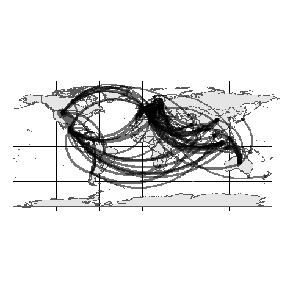

<!-- README.md is generated from README.Rmd. Please edit that file -->

# geoflowr

The goal of geoflowr is to …

## Installation

You can get the most recent version of geoflowr from
[Github](https://github.com/ropenscilabs/geoflowr) and install with:

``` r
devtools::install_github("ropenscilabs/geoflowr")
```

## The Problem

We are hopeing to plot spatial flows using `ggplot2` and then using
`gganimate` to show changes through time. There are many ways to do this
ouside `ggplot2` and there is already a `geom_curve()` functionthat
creates a plot similar

### Example Dataset

``` r

library(ggplot2)
library(readr)
library(purrr)
library(dplyr)
library(sf)
library(gganimate)

coords <- read_csv('data-raw/world.csv') %>% 
  filter(!is.na(admin)) %>%
  select(admin,
         x = Longitude, 
         y = Latitude)

#flows <- read_csv('data-raw/201802.csv') %>%
flows <- map_df(list.files(path = "data-raw", pattern = "[0-9].csv", full.names = TRUE), 
                 read_csv, col_names = TRUE) %>%
  select(year,
         period,
         reporter,
         partner,
         netweight_kg)
  
src <- coords %>%
  rename(reporter = admin)
dst <- coords %>% 
  rename(partner = admin)

# join coords to src and dst

df <- flows %>%
  left_join(src, by = 'reporter') %>%
  left_join(dst, by = 'partner', suffix = c('_src','_dst')) %>%
  filter(complete.cases(.),
         partner != 'World')

world1 <- sf::st_as_sf(maps::map('world', plot = FALSE, fill = TRUE))
```

### Current ggplot implimentation - geom\_curve()

``` r

ggplot(df) + 
  geom_sf(data = world1) +
  geom_curve(aes(x = x_src, y = y_src, xend = x_dst, yend = y_dst, 
                 alpha = 0.5,
                 size = netweight_kg / max(df$netweight_kg)),
             #curvature = 0.75, angle = -45,
             arrow = arrow(length = unit(0.15,"cm"))
             ) +
  theme_void() + 
  theme(legend.position="none") +
  transition_time(period) +
  ease_aes('linear')
```



### Convert Great Circle to points

``` r

library(geosphere)
#greatCircle(c(df$x_src[1], df$y_src[1]), c(df$x_dst[1], df$y_dst[1]), n=360, sp=FALSE)

# finter to single month for now

mar <- df %>% 
  as_tibble() %>%
  filter(period == 201803) 

mar_pts <- lapply(1:nrow(mar), function(r){
  
  row = mar[r,]
  
  pts <- gcIntermediate(c(row$x_src, row$y_src), c(row$x_dst, row$y_dst), n=36, sp=FALSE, breakAtDateLine = F) %>%
    as.data.frame() %>%
    mutate(year = row$year,
           period = row$period,
           group = r,
           n = 1:36,
           reporter = row$reporter,
           partner = row$partner,
           netweight_kg = row$netweight_kg)
    
}) %>% plyr::ldply()
```

``` r

ggplot() + 
  geom_sf(data = world1) +
  geom_line(data = mar_pts, aes(x = lon, y = lat, group = group)) +
  theme_void() +
  transition_reveal(id = group, along = n) +
  ease_aes('linear')
```


``` r

filter(mar_pts, lat < )
```

### Convert to SF object

``` r

# https://www.jessesadler.com/post/great-circles-sp-sf/

mar_sf <- mar %>%
  rowwise() %>%
  mutate(line = st_sfc(st_linestring(gcIntermediate(c(x_src, y_src), c(x_dst, y_dst), n=36, sp=FALSE, breakAtDateLine = F), dim = 'XY'))) %>%
  st_as_sf(sf_column_name = 'line', crs = 4283)


mapview::mapview(mar_sf)@map
```


``` r

# wrld_wrap <- st_wrap_dateline(mar_sf, options = c("WRAPDATELINE=YES", "DATELINEOFFSET=180"),
#    quiet = TRUE)

ggplot() + 
  geom_sf(data = world1) +
  geom_sf(data = mar_sf) +
  theme_void() +
  transition_components('reporter') +
  ease_aes('linear')
```

### Errors at Poles and Map borders

Using these methods great circle lines and point annimations appear
distorted at the poles and the borders of the map. To avoid this we
propose using destination and source points to draw a complete great
circle. This line can then be split where the line is intersected
resulting two lines. Each line can be checked for proximity to these map
regions and excluded where nesecary.

The method is outlined below, but there is an issue with using
`st_split()` on a windows machine.

``` r

src <- c(df$x_src[2], df$y_src[2])
dst <- c(df$x_dst[2], df$y_dst[2])
gc <- greatCircle(src, dst, n=16, sp=FALSE)

gcl = st_sfc(st_linestring(gc), crs = 4283)
mp <- st_sfc(st_multipoint(rbind(src,dst)), crs = 4283)

#mp2 = st_snap(mp, gcl, 1) # move points to intersect gcl line

# then use st_split(gcl, mp2) but requires lwgeom which is not working on windows....


ggplot() + 
  geom_sf(data = world1) +
  geom_sf(data = gcl, size = 2.5) +
  geom_sf(data = mp, colour = "red", fill = "red", size = 10) +
  theme_void()
```


