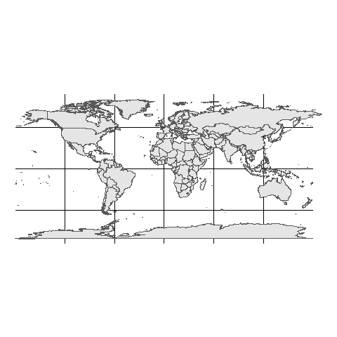

Workflow geoflowr
================
Gabriela D'Souza
22/11/2018

Short Version
-------------

To create geographical flows of data using waste plastics exports as an example

Long form
---------

Packages used for this project include \* tidyverse \* sf \* what else? \* gganimate

We were interested in creating a better interface for the mapping flows of trade and other variable data across geographical boundaries.

Our first step was to create a package that would allows users to build visualisations of flows between geographical destinations which in our example was countries.

We subsequently found Joshua Kunst's geom\_curve which rather helpfully allows us to specify curves between locations. This made our project much easier, as we had initially thought we might have to create our own package to do this.

Wrong Turns
-----------

### Modifications to geom\_curve package

We initially thought that we could just use geom\_curve however we realised that geom\_curve doesn't do a great circle, it's just a way of connecting an x and y point and therefore was not suitable for mapping. While this might work on detailed maps using just a handful of countries, or one country, it doesn't work on a global scale so we had to scrap this idea.

### Using simple features package instead

Simplefeatures was better geared towards mapping and contains geographical objects that respond to correct mapping (as long as you don't include the problematic north and south pole (see more below)).

### Geom\_segment\_plus

We encountered a problem with specifying the direction of flows. While geom\_curve allowed us to have arrows on our lines, the simple features suite of functions wouldn't. So we experimented t geom\_sf unfortunately does not allow us to specify arrows on our flows

Workaround using Line objects to work with great circles or straightlines to work between two sets of points, but involves manipulating the lines representing flows to shorten them at the ends, which can be achieved by buffering locations and intersecting the points with the lines (all part of sf functionality).

